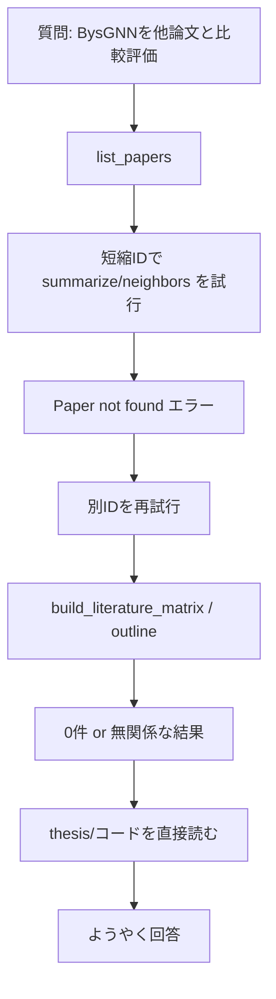

# BysGNN research evaluation
_Exported on 7/7/2026 at 18:44:33 GMT+9 from Cursor (3.10.11)_

---

**User**

BysGNNの研究について他の論文と合わせてどのように評価できるか？

---

**Cursor**

BysGNNと関連論文の評価観点を整理するため、まず文献グラフのMCPとワークスペース内の論文を確認します。


BysGNN系の研究は、単体で「精度が高いか低いか」を見るのではなく、**研究系譜・タスク適合性・グラフ設計・データ条件**の4軸で他論文と並べて評価するのが適切です。インデックス済み文献と本プロジェクトの論文構成を踏まえて整理します。

---

## 1. BysGNN研究の位置づけ（系譜としての評価）

BysGNNは次の3段階で発展しており、各段階で評価の焦点が変わります。

| 段階 | 研究 | 評価の問い |
|------|------|-----------|
| 原論文 | Hajisafi et al. (SIGSPATIAL 2023) BysGNN | POI訪問予測で、動的グラフ＋多様な文脈情報が有効か |
| 拡張 | 可知井ら Ext.BysGNN (2025) | POI→グリッド、消費カウント予測への転用は妥当か |
| 本研究 | GAT版 Ext.BysGNN + Poisson拡張 | GCNの均等集約限界をGATで克服できるか |

原論文BysGNNの特徴は、時系列・意味・距離・分類などの文脈から**動的にグラフを構築**し、POI訪問を予測する点です。Ext.BysGNNはこの枠組みを**グリッド単位の消費活動予測**（TOYOPay + 人流）へ適応させたものです。

本研究の実験結果（拡張倍率1）では、GAT版がGCN版を MAE 1.041→0.949、RMSE 2.553→2.455 で上回っており、**「BysGNN系の次の改善点＝グラフ集約部」**という評価軸が妥当だと示せます。

---

## 2. 他論文との比較マトリクス（何と比べられるか）

インデックス済み文献を軸にすると、次のように整理できます。

### A. 空間グラフ系（最も近い比較対象）

| 論文 | タスク | グラフ | BysGNNとの関係 |
|------|--------|--------|----------------|
| **BysGNN** | POI訪問予測 | 文脈から動的生成 | 基盤 |
| **STGCN** | 交通・人流 | 道路網など**固定トポロジ** | グラフは固定、時空畳み込みが中心 |
| **Shin 2023** | 都市経済状態 | モビリティ由来GNN | 表現学習寄り、予測タスクは異なる |
| **Wang 2021** | 観光流 | 複数グラフ | マルチリレーションは類似だが対象が異なる |

**評価のポイント**: STGCNは「空間近接＋時間畳み込み」が強みですが、グラフ構造は事前固定です。BysGNNは**予測時点ごとに関係行列を再計算**するため、「近傍の意味が時間とともに変わる消費行動」には理論的に適しています。ただし**同一データセットでの数値比較は原論文では困難**（BysGNNはSafeGraph、本研究はTOYOPay）なので、文献上は**設計思想の対比**、実験上は**同一TOYOPayデータへのベースライン実装**が必要です。

### B. グリッド畳み込み系

| 論文 | 特徴 | BysGNNとの差 |
|------|------|-------------|
| **ST-ResNet** | グリッド上のResNet、外部要因をチャネル結合 | 明示的グラフなし、空間依存は畳み込みで暗黙学習 |
| **Fan 2014 (CitySpectrum)** | テンソル分解 | 解釈性は高いが深層表現力は限定的 |

**評価のポイント**: ST-ResNetを同一TOYOPayグリッドデータに実装すれば、「動的グラフ vs グリッドCNN」の**実証比較**が可能です。BysGNN系は**グリッド間の非対称・非一様な影響**（駅前と住宅地など）をグラフで明示できる点が差別化要因になります。

### C. 大規模言語モデル系

| 論文 | 特徴 | BysGNNとの差 |
|------|------|-------------|
| **UrbanGPT** | LLMによる都市時空予測 | テキスト・構造化データの統合、解釈性と汎化が強み |

**評価のポイント**: UrbanGPTは「データ効率・解釈性・ゼロショット汎化」で優位な可能性がありますが、**地域限定の細粒度カウント予測**では、ドメイン特化のBysGNN系の方が実用的な場合があります。比較するなら、同一グリッド・同一期間でのMAE/RMSEが妥当です。

---

## 3. 評価軸の具体化（論文レビューで使える観点）

### 軸1: タスク適合性
- **直接比較可能**: 同一グリッド・同一指標（MAE/RMSE/MASE）・同一分割
- **概念的比較のみ**: POI予測（BysGNN原論文）vs 消費カウント（Ext.BysGNN）
- 本研究のTOYOPayは**制度依存・期間限定**のため、文献比較では「汎化性の限界」として明記する必要があります（論文の考察節でも言及済み）

### 軸2: グラフ設計
| 観点 | BysGNN系 | STGCN等 |
|------|----------|---------|
| グラフ生成 | 動的（意味・距離・時系列から） | 静的（道路・センサ配置） |
| 集約方式 | GCN→GAT（本研究） | 通常GCN/ChebConv |
| 解釈性 | 関係行列・アテンション重み | エッジ固定で解釈しやすい |

GAT導入の評価は、「近傍寄与が一様でない」という仮説と整合します。GCNは関係行列に基づく**ほぼ均等な近傍混合**になりやすく、スパースな消費分布では平均化バイアスが出やすい、という整理が文献＋本研究結果と両立します。

### 軸3: データ・拡張
- BysGNN原論文: SafeGraph（非公開）、POI単位
- Ext.BysGNN/本研究: TOYOPay + WiFi人流、グリッド単位、**ゼロ多・裾の長いカウント**
- Poissonリサンプリングは、ST-ResNet等の連続値ノイズ拡張とは**タスク特性に沿った独自の評価軸**です
- 本研究の結果: 拡張倍率の最適値がGAT（15）とGCN（10）で異なる → **手法と拡張は独立に最適化すべき**という知見

### 軸4: 限界・未検証点（文献横断）
インデックス文献から見える共通限界:
- **外生要因**（イベント、キャンペーン、天候）の未統合
- **汎化性**（自治体・制度変更への適応）
- **統計的有意性**（本研究でも固定条件の一次結果に留まる）
- **解釈性**（アテンション重みと実際の商業立地・人流の対応は未検証）

---

## 4. 実験設計としての「他論文と合わせた評価」提案

現状のGCN vs GAT比較に加え、次を行うと文献上の位置づけが明確になります。

### すぐできる評価
1. **系譜内アブレーション**: GCN/GAT、拡張倍率、入力特徴（人流のみ/意味特徴なし等）— BysGNN原論文も同様のアブレーションを実施
2. **代表グリッドの時系列分析**: 全体MAEに加え、高利用・低利用・ゼロ多グリッドでの差分
3. **アテンション重みの可視化**: GATの理論的優位を地理的に検証（本研究の今後課題）

### 文献比較を強化する評価
4. **同一データへの外部ベースライン**: ST-ResNet、単純GRU/LSTM、固定隣接GCN（BysGNNの動的関係行列を使わない版）
5. **指標の統一**: MAE/RMSEに加えMAPE（ゼロ除算注意）、ゼロ率別の誤差
6. **期間横断検証**: 3期間をleave-one-period-outで評価し、UrbanGPT等が主張する汎化性と対比

### 文献レビュー（Related Work）の書き方
```
人流・都市活動予測（時系列・テンソル分解）
  ↓ 空間構造の明示化
グラフニューラルネットワーク（STGCN, 観光流, 都市表現）
  ↓ 動的グラフ・多文脈統合
B

---

**User**

これはMCPのテストで調査してもらいましたがかなりリクエストしないとできないのかなと思ったけどlgc　MCPについて評価してほしい

---

**Cursor**

LGC MCPの設定とツール動作を再確認し、前回の利用体験を踏まえて評価します。


前回のBysGNN調査で感じた「リクエストが多い」点は妥当な印象です。LGC MCP（LiteratureGraphContext v0.4.0）を再検証した結果をまとめます。

## 総合評価

**コンセプトは良いが、現状は「エージェント向けの中間データ層」としては使える一方、ワンショットの文献レビューには向いていない。**  
設計上、1回の質問に対して複数ツールを組み合わせる前提です。加えて、今回のプロジェクトでは**データ品質の問題**と**ツールの不安定さ**が重なり、リクエスト数がさらに増えていました。

---

## 良い点

### 1. 設計思想が明確
READMEの方針どおり、LGCは「関連研究を書くAI」ではなく、**根拠付きの構造化データ層**です。

```text
find_papers_by_method → summarize/compare → find_limitations → エージェントが統合
```

Claims / Limitations に `paper_id`, `page`, `section`, `evidence_text` が付くのは、論文執筆には有用です。

### 2. 比較系ツールは実用的
`compare_papers` と `build_literature_matrix` は、タスク・手法・データセット・貢献・限界を横並びにでき、関連研究の整理に向いています。  
BysGNNの最小ワークフローは、正しい `paper_id` が分かれば **4〜6回のツール呼び出し**で回せます。

| 手順 | ツール | 結果 |
|---|---|---|
| 1 | `find_papers_by_method("BysGNN")` | 1件ヒット |
| 2 | `summarize_paper("02_hajisafi2023_bysgnn")` | 成功 |
| 3 | `compare_papers([BysGNN, STGCN, GAT])` | 3件比較 |
| 4 | `build_literature_matrix("BysGNN")` | 1件 |
| 5 | `find_limitations("graph attention")` | ヒットあり |

### 3. CLIとの併用が可能
MCPが不安定なときは `litgraph query compare ...` などCLIで同じ操作ができます。

---

## 問題点（「リクエストが多い」原因）

### 1. ツールが細かく分割されている（設計上のコスト）
14ツールあり、1つの研究質問を答えるのに複数回の往復が必要です。  
`compare_papers` だけでは系譜（CITES/EXTENDS）が取れず、`get_paper_neighbors` も別途必要です。

**高レベルな1ツール（例: `evaluate_research_topic`）がなく、エージェント側のオーケストレーションコストが高い**のが実感としての「重さ」の主因です。

### 2. `paper_id` の発見が難しい
正しいIDはファイル名ベースです（例: `02_hajisafi2023_bysgnn`）。  
`bysgnn`, `hajisafi2023`, `eschbach2024` などは**存在せず**、前回は試行錯誤でリクエストが増えました。

`list_papers` は返しますが、**どのIDを次に使うかのガイドが弱い**です。

### 3. MCP経由で一部ツールが不安定
再検証の結果:

| ツール | Python直接呼び出し | Cursor MCP |
|---|---|---|
| `compare_papers` | 成功 | 成功 |
| `find_limitations` | 成功 | 成功 |
| `summarize_paper` | 成功 | **失敗**（Paper not found） |
| `get_evidence_for_claim` | 成功 | **失敗** |
| `get_paper_neighbors` | 成功 | **失敗** |

原因として有力なのは:
- `serve-mcp` が2プロセス + `litgraph viz` が同時稼働し、**Kuzu DBの排他ロック**が競合している
- MCPサーバーが古いDB状態のまま

毎回 `finder.close()` する実装も、並行アクセス時に不安定要因になり得ます。

### 4. トピック検索が単純すぎる
`build_literature_matrix` と `generate_related_work_outline` は**部分文字列マッチ**です。

```
"spatial graph neural network consumption prediction" → 0件
"BysGNN" → 1件
"graph attention" → 2件
```

マッチしない場合、`related_work_outline` は**全論文を返す**フォールバックがあり、前回のような無関係なアウトライン（fractional operators 等）が出ます。これはMCPのバグというより検索ロジックの限界です。

### 5. グラフの関係エッジが薄い
BysGNNの `get_paper_neighbors` は**空**でした。CITES / EXTENDS などが未構築だと、「BysGNNと他論文の関係」を自動では辿れません。

### 6. このプロジェクト固有のデータ品質問題（致命的）
インデックス済み18論文のうち、**ファイル名と中身が一致しないPDF**がありました。

| ファイル名 | 想定 | 実際の中身 |
|---|---|---|
| `11_zhang2017_stresnet.pdf` | ST-ResNet | 量子光学（arXiv:1611.05997） |
| `10_cao2020_stgnn.pdf` | STGNN | 分数階最適制御（arXiv:2010.11648） |
| `12_lin2019_deepstnplus.pdf` | DeepSTN+ | 素粒子物理 |

LGCの抽出はPDFの中身を正しく読んでいますが、**誤ったPDFが入っているため比較結果が壊れます**。  
また **Ext.BysGNN（可知井2024）が未インデックス**で、あなたの研究の直接比較対象がグラフにありません。

---

## 前回の調査で何が起きていたか



つまり「MCPが弱い」だけでなく、
1. ID試行錯誤
2. 一部ツールのMCP不安定
3. トピック検索の粗さ
4. PDFの誤配置
5. Ext.BysGNN未登録

が重なって、**10回以上のリクエストが必要**になっていました。

---

## 使い分けの評価

| 用途 | 適性 |
|---|---|
| 登録済み論文の根拠付き比較 | ◎（`compare_papers`） |
| 手法名での検索 | ○（`find_papers_by_method`） |
| 限界のエビデンス収集 | ○（`find_limitations`） |
| 自然言語トピックでの網羅探索 | △（部分文字列のみ） |
| 研究系譜の自動追跡 | △（neighborが空のことが多い） |
| 1プロンプトでの関連研究ドラフト | ✗（エージェント統合が必要） |
| 未登録論文（Ext.BysGNN等）の評価 | ✗（先にPDF登録が必要） |

---

## 改善提案（優先度順）

### すぐできる（運用）
1. **誤ったPDFを差し替え**（ST-ResNet, STGNN, DeepSTN+）
2. **Ext.BysGNNのPDF/notesを `papers/` に追加**して `scan → parse → extract → build`
3. **MCPサーバーを1つに整理**（`viz` と重複 `serve-mcp` を止めて再起動）
4. エージェントには最初に `list_papers` → 返った `paper_id` をそのまま使うよう指示

### LGC側の改善（プロダクト）
1. **`search_papers(query)`** — タイトル/タスク/手法のファジー検索
2. **`evaluate_topic(topic, paper_ids?)`** — compare + limitations + neighbors を1回で
3. **topic未マッチ時に全論文フォールバックしない**
4. **MCPのDBロック耐性**（接続プール、または読み取り専用モード）
5. **paper_idのエイリアス**（`bysgnn` → `02_hajisafi2023_bysgnn`）
6. **BibTeXからの引用関係自動構築**（CITESエッジ）

---

## 結論

**LGC MCPは「論文PDFを構造化して、根拠付きで比較するデータ基盤」としては有望**です。ただし現状は:

- エージェントが複数ツールを組み立てる前提で、**1質問あたりのリクエスト数は多くなりやすい**
- **トピック検索・neighbor・高レベルAPIが弱く**、試行錯誤が増える
- **今回の環境ではPDF誤配置とMCP不安定**がさらにコストを押し上げた

あなたのBysGNN研究を他論文と評価するなら、LGC単体より:

1. LGCで **BysGNN + STGCN + GAT + UrbanGPT** など正しいPDFを `compare_papers`
2. **Ext.BysGNNは手元の論文/thesisで補完**
3. エージェントが統合して「位置づけ・差分・限界」を書く

というハイブリッドが現実的です。

PDFの差し替えとExt.BysGNNのインデックス追加、MCPの再起動まで進めますか？

---

**User**

論文内のことを聞かれたときにMCPがどの論文について聞かれたかをIDで返すことができないのかな

ファイル名やIDはMCP内で利用するよね
けど質問は曖昧なことが多いよ　GNNについての研究とか交通予測とかそういったものに対応できるのか？

---

**Cursor**

曖昧な質問（GNN、交通予測など）でどの論文がヒットするか、MCPの検索系ツールを実際に試して確認します。


**部分的にはできます。ただし「曖昧な質問 → 該当論文の `paper_id` を返す」専用ツールは今はなく、エージェントが複数ツールを組み合わせる前提です。**

## 現状：IDは返せるが、入口が分かれている

LGC MCPは内部で `paper_id`（例: `02_hajisafi2023_bysgnn`）を軸に動いています。曖昧な質問に対して **`paper_id` を返せるツール**は次のとおりです。

| ツール | 曖昧な入力 | 返るもの |
|---|---|---|
| `find_papers_by_method` | 「GNN」「attention」など | `paper_id`, `title`, `method` |
| `find_papers_by_task` | 「traffic forecasting」など | `paper_id`, `title`, `task` |
| `build_literature_matrix` | 「traffic」「GNN」など | マッチした論文の `paper_id` 一覧 |
| `find_limitations` | トピック文字列 | `paper_id` + 根拠テキスト |
| `list_papers` | なし（全件） | 全 `paper_id` |

逆に **`summarize_paper` や `get_evidence_for_claim` は `paper_id` が先に必要**です。  
「論文の中身について聞かれた」ときに、LGCが自動で「どの論文か」を特定して返す**一本化された入口はない**、というのが今の設計です。

想定フローはこうです。

```text
ユーザー: 「GNNの交通予測について」
  ↓
find_papers_by_method("GNN")  → paper_id 候補
find_papers_by_task("traffic forecasting")  → paper_id 候補
  ↓
compare_papers([id1, id2, ...])  → 中身の比較
```

---

## 曖昧な質問への対応度（実測）

今の toyopay グラフ（18論文）で試した結果です。

| 質問の言い方 | 使うツール | 結果 |
|---|---|---|
| 「GNN」 | `find_papers_by_method` | **4件**（BysGNN, GraphWaveNet, CausalGRIT 等） |
| 「graph neural network」 | 同上（エイリアス） | 同上 |
| 「attention」 | `find_papers_by_method` | **複数件**（GAT 等） |
| 「traffic forecasting」 | `find_papers_by_task` | **4件**（STGCN, DCRNN 等） |
| 「traffic prediction」 | `find_papers_by_task` | **1件**（STGCN のみ） |
| 「traffic prediction」 | `find_papers_by_method` | **0件** |
| 「consumption prediction」 | `find_papers_by_task` | **0件** |
| 「交通予測」 | どれでも | **0件**（日本語未対応） |
| 「GNN」 | `build_literature_matrix` | **1件のみ**（BysGNN） |
| 「traffic」 | `build_literature_matrix` | **7件** |

つまり:

- **「GNN」「交通予測（英語）」程度なら、ツールと言い方を選べば `paper_id` は取れる**
- **言い方で結果が大きく変わる**（`traffic prediction` vs `traffic forecasting`）
- **method で聞くか task で聞くかでヒットが変わる**
- **日本語の曖昧質問はほぼ無理**

---

## なぜ曖昧対応が弱いか

### 1. 検索が「抽出タグの部分一致」だけ
`find_papers_by_method` / `find_papers_by_task` は、LLM抽出時に付いた `Method` / `Task` ノードに対する **SQL の `CONTAINS` 検索**です。意味理解やベクトル検索はありません。

### 2. エイリアスがほぼ未設定
`.litgraph/aliases.yaml` には今こうしかありません。

```yaml
methods:
  Graph Neural Network:
  - GNN
  - graph neural networks
tasks: {}   # 空
```

だから「GNN」は効くが、「交通予測」「消費予測」などは **aliases に登録しない限りヒットしにくい**です。

### 3. ツールごとに検索ロジックが違う
- `find_papers_by_*` → Method/Task ノードを検索
- `build_literature_matrix` → タイトル・タスク・手法・限界テキストの部分一致
- `find_limitations` → 限界テキストのみ

同じ「GNN」でも、`find_papers_by_method` では4件、`build_literature_matrix` では1件、と**結果が揃いません**。

### 4. 「質問 → 論文特定」専用APIがない
READMEの設計思想どおり、LGCは**データ層**で、質問解釈はエージェント側の仕事です。  
「この質問はどの論文についてか」を1回で返す `search_papers(query)` のようなツールは未実装です。

---

## 実用上の答え

> 論文内のことを聞かれたときに、MCPがどの論文かをIDで返せるか？

**できますが、今はエージェントが次の手順を踏む必要があります。**

```text
1. find_papers_by_method / find_papers_by_task で候補 paper_id を得る
2. 複数候補なら compare_papers か summarize_paper で中身確認
3. 回答時に paper_id を明示して引用
```

例:「GNNの交通予測について」

```text
find_papers_by_method("GNN")
  → ['02_hajisafi2023_bysgnn', '08_wu2019_graphwavenet', ...]

find_papers_by_task("traffic forecasting")
  → ['06_yu2017_stgcn', '07_li2017_dcrnn', ...]

compare_papers([共通するIDたち])
```

---

## 改善するなら（優先度順）

1. **`search_papers(query)` を追加** — method/task/title/limitation を横断検索し、`paper_id` + マッチ理由 + スコアを返す
2. **`aliases.yaml` の tasks を充実** — 例:
   ```yaml
   tasks:
     Traffic prediction:
     - traffic forecasting
     - traffic prediction
     - 交通予測
     Consumption prediction:
     - consumption forecasting
     - 消費予測
   ```
3. **検索ロジックの統一** — `find_*` と `build_literature_matrix` で同じマッチングを使う
4. **候補が複数のときの `disambiguate`** — 「GNNについて」と聞かれたら候補一覧を返し、ユーザー/エージェントが選ぶ

---

## まとめ

| 質問 | 答え |
|---|---|
| IDを返せるか？ | **一部のツールでは返せる**（`find_papers_by_*` など） |
| 曖昧な質問に対応できるか？ | **英語のキーワードならある程度可。日本語・自然文は弱い** |
| 1回の質問で完結するか？ | **いいえ。候補取得 → ID確定 → 中身取得の多段が必要** |

「GNN」「交通予測」のような質問は、**今のLGCでも英語キーワード＋適切なツール選択なら `paper_id` まで辿れます**。ただしそれはMCPが自動解釈しているのではなく、**抽出済みタグへのキーワード検索**です。

`search_papers` のような横断検索ツールを LGC 側に足す案を、LiteratureGraphContext リポジトリ向けに具体化することもできます。

---

**User**

https://github.com/getzep/graphiti などではAPIをつかって埋め込みを使っていると思うけどそうした方針はどうかな？

---

**Cursor**

Graphitiの方針とアップロード資料を確認し、LGCへの埋め込みAPI活用の是非を整理します。


**結論から言うと、Graphitiのように「埋め込みAPIを使う方針」は、LGCの弱点（曖昧な質問への論文特定）を埋めるには有効です。ただし Graphiti 全体に寄せるのではなく、LGCの構造化グラフの上に「検索レイヤー」として足すのがよいと思います。**

## Graphiti と LGC の違い

| 観点 | [Graphiti](https://github.com/getzep/graphiti) | LGC（現状） |
|---|---|---|
| 目的 | エージェントの動的メモリ・文脈グラフ | 論文レビュー用の根拠付き文献グラフ |
| 取り込み | エピソード（会話・非構造化データ）を逐次追加 | PDFをバッチで `scan→parse→extract→build` |
| 検索 | **ハイブリッド**（埋め込み + BM25 + グラフ探索） | Method/Task の **部分文字列一致** |
| 構造 | 学習的オントロジー、時系列の事実更新 | 固定スキーマ（Paper, Method, Task, Claim, Limitation） |
| 根拠 | エピソードへのトレース | **page / section / evidence_text**（論文引用向き） |
| API依存 | LLM + Embedding API が前提 | LLM抽出のみ（検索はローカルDB） |

Graphitiは「何について聞かれているか」を**意味検索で当てにいく**設計です。  
LGCは「当たった論文の中身を**構造化して根拠付きで返す**」設計です。

---

## 埋め込み方針は「良い」と思う理由

前回の課題はまさにここでした。

- 「GNNの研究」→ method検索ならヒット、matrix検索だと1件だけ
- 「traffic prediction」→ method 0件、task 1件
- 「交通予測」→ 全部0件

これは **タグ付けの揺れ** と **キーワード検索の限界** が原因で、埋め込み検索が効く典型例です。

```text
現状:
  質問 → Method/Task ノードの CONTAINS → paper_id

埋め込み追加後:
  質問 → ベクトル検索（title + tasks + methods + claims + limitations）
       → paper_id + score + match_reason
       → 必要なら既存の compare_papers / summarize_paper へ
```

曖昧な質問に対して `paper_id` を返す入口として、埋め込みはかなり有効です。

---

## ただし Graphiti 丸ごと置き換えはおすすめしない

LGCのROADMAPにもある通り、**ギャップクラスタリング用の埋め込みパイプラインは意図的にスコープ外**です。論文レビューでは次の点が重要だからです。

1. **引用可能性** — 「p.3 Introduction のこの一文」が必要。Graphiti型の要約ファクトだけだと論文執筆には弱い
2. **スキーマの安定性** — task/method/dataset を固定して比較表を作れる
3. **再現性** — 同じPDFから同じグラフが作れる（バッチ索引向き）
4. **コスト** — Graphitiは取り込み・検索のたびにLLM+Embedding。LGCは索引時にLLM、検索はローカル

Graphitiは「常に変わるエージェント文脈」向き、LGCは「論文セットを一度索引して何度も問い合わせる」向きです。

---

## おすすめは「ハイブリッド」

Graphitiの **検索思想だけ** 取り入れる形がよいと思います。

```text
[索引時・オフライン]
PDF → LLM抽出（現状維持）
    → 各 Paper / Claim / Limitation を Embedding API でベクトル化
    → Kuzu または別ベクトルストアに保存

[問い合わせ時・MCP]
search_papers(query)     ← 新規。埋め込み + キーワード + エイリアス
  ↓ paper_id 候補
summarize_paper / compare_papers / find_limitations  ← 現状維持
  ↓
エージェントが統合・執筆
```

### 新ツール案: `search_papers`

```json
{
  "query": "GNNの交通予測",
  "top_k": 5
}
```

返却例:

```json
{
  "papers": [
    {
      "paper_id": "06_yu2017_stgcn",
      "title": "Spatio-Temporal Graph Convolutional Networks...",
      "score": 0.87,
      "match_fields": ["task", "method", "title"],
      "match_reason": "traffic forecasting + graph convolutional"
    }
  ]
}
```

これで「どの論文について聞かれたか」を **1回のMCP呼び出しで `paper_id` 付きで返せる** ようになります。

---

## 実装の現実的な段階

| 段階 | 内容 | 効果 | コスト |
|---|---|---|---|
| **Phase 1** | `aliases.yaml` 拡充 + `search_papers`（キーワード横断） | 中 | 低（API不要） |
| **Phase 2** | Paper単位の埋め込み索引（`text-embedding-3-small` 等） | 高 | 索引時のみ |
| **Phase 3** | Claim/Limitation単位の埋め込み + ハイブリッド（BM25併用） | 很高 | 中 |
| **Phase 4** | Graphiti相当のリアルタイム更新 | 別用途 | 高 |

**Phase 1 + 2 だけで、今感じている「曖昧質問に弱い」問題の大半は解消できる** と思います。

埋め込み対象は論文全文ではなく、抽出済みの構造化テキストで十分です。

```text
embedding_text = title + tasks + methods + contributions + limitations
```

18論文なら索引コストはほぼ無視できます。

---

## Graphitiから取るべきもの・取らないもの

### 取るべき
- 埋め込み + キーワードのハイブリッド検索
- `search` 系MCPツール（質問 → 候補返却）
- スコアとマッチ理由の返却（エージェントの判断材料）
- オプションでローカル埋め込み（Ollama `nomic-embed-text`）

### 取らない（LGCの強みを壊す）
- エピソード逐次更新モデルへの全面移行
- 時系列ファクトの自動 invalidation（論文は基本的に不変）
- 学習的オントロジー（比較表がブレる）
- 検索結果のLLM要約を根拠の代わりにする

---

## まとめ

| 質問 | 答え |
|---|---|
| Graphitiのような埋め込みAPI方針はどうか？ | **検索レイヤーとしては賛成**。曖昧質問→`paper_id` 特定に直結する |
| LGCをGraphitiに置き換えるべきか？ | **いいえ**。用途が違う |
| 最適解は？ | **構造化グラフ（LGC）+ 埋め込み検索（Graphiti的）のハイブリッド** |

一言で言うと:

> **LGCは「論文の中身を構造化して根拠付きで返す器」、埋め込みは「どの論文かを当てる入口」——役割を分けるのがよい。**

LGCリポジトリ向けに、`search_papers` の具体的な設計（スキーマ・Kuzu連携・MCPツール定義）まで落とし込むこともできます。

