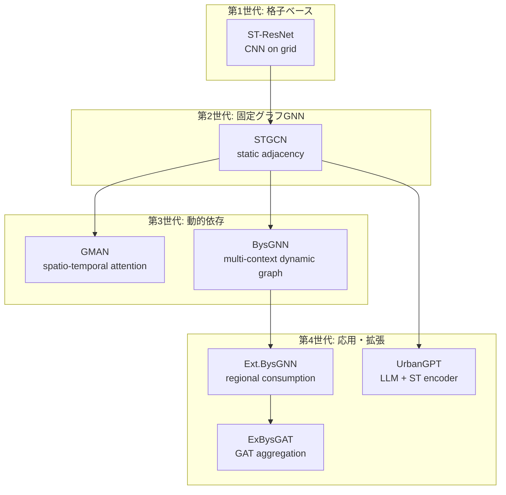

# BysGNN research evaluation
_Exported on 7/7/2026 at 20:10:01 GMT+9 from Cursor (3.10.11)_

---

**User**

BysGNNの研究について他の論文と合わせてどのように評価できるか？

---

**Cursor**

BysGNNと関連論文の位置づけを整理するため、まずリポジトリ内の資料と文献グラフを確認します。


BysGNN（Hajisafi et al., SIGSPATIAL 2023）は、**POI訪問数予測**に特化し、空間・時間・意味・分類の文脈を統合して**動的グラフを学習する**点で、他の時空間予測研究と比較評価できます。本リポジトリの Ext.BysGNN / ExBysGAT 研究とも直結する位置づけです。

---

## 1. BysGNNの研究的位置づけ

BysGNNの核心は「**固定グラフではなく、入力から関係行列を学習する**」ことです。

実装（`external/busyness-graph-neural-network`）では、おおむね次の流れになっています。

1. **時間**: 各POIのGRU + 時間アテンション
2. **系列間相関**: Multi-head attention で動的な系列間関係を推定
3. **文脈統合**: 距離行列・意味埋め込み（POIカテゴリ）を重み付き合成
4. **空間集約**: 学習した隣接行列上で GCN
5. **予測**: 全結合層で将来訪問数を出力

```167:221:external/busyness-graph-neural-network/busyness_graph/models/base_model.py
    def forward(self, x, static_features=None):
        attention, weighted_res = self.latent_correlation_layer(x)
        ...
        attention = ((self.att_alpha*self.dist_adj) + (1-self.att_alpha)*embed_att) * attention
        ...
        X_gnn = self.convs[0](X, edge_indices, edge_attrs)
        ...
        forecast = self.fc(X_hat)
```

つまり BysGNN は、**「グラフ予測」＋「多文脈からの動的グラフ構築」** の交点に立つ研究です。

---

## 2. 関連研究との比較軸（文献マトリクス）

| 研究 | 主タスク | 空間表現 | グラフ | 時間表現 | 文脈情報 | 主な強み | BysGNNとの差分 |
|------|---------|---------|--------|---------|---------|---------|---------------|
| **ST-ResNet** (Zhang et al., 2017) | グリッド人流 | 2D CNN | なし（格子） | 3D CNN + 外部特徴 | 天候・イベント | 古典的深層STの基準 | 非格子・POI単位・意味文脈なし |
| **STGCN** (Yu et al., 2018) | 交通量予測 | 道路網グラフ | **静的**隣接 | 時間畳み込み | 限定的 | GNN+STの定番 | グラフ固定、POI意味を扱わない |
| **GMAN** (Zheng et al., 2020) | 交通量予測 | 道路網グラフ | **動的** attention | ST-attention + encoder-decoder | 時空間埋め込み | 長期予測・動的依存 | 距離/意味/分類の統合は弱い |
| **BysGNN** (Hajisafi et al., 2023) | **POI訪問予測** | POIグラフ | **動的**（距離+意味+系列相関） | GRU + attention | **空間・時間・意味・分類** | POI特化・解釈可能な隣接 | SafeGraph依存、GCN集約 |
| **UrbanGPT** (Li et al., 2024) | 汎用都市予測 | 明示グラフ不要 | 暗黙的 | 時間畳み込み + LLM | テキスト指示 | ゼロショット汎化 | 数値系列・局所依存の精密さは別課題 |
| **Ext.BysGNN** (可知井ら) | 地域消費予測 | 36グリッド | BysGNN流儀 | 複数時系列 | 人流・TOYOPay・日付・意味 | 実データ適用 | POI→地域への拡張 |
| **ExBysGAT** (本研究) | 同上 | 同上 | GCN→**GAT** | 同上 | 同上 | 近傍重要度の学習 | BysGNN系の改良 |

---

## 3. 研究系譜としての読み方



**評価の要点**:
- BysGNNは GMAN と同じ「動的依存」系だが、**POI固有文脈（カテゴリ意味・距離・訪問系列）の統合**が差別化要因
- STGCN 系は再現性・ベースラインとして重要
- UrbanGPT は「データ不足・タスク横断」軸での比較対象（同一条件の直接数値比較は難しい）

---

## 4. どの観点で評価すべきか

### (A) タスク適合性
| 観点 | 評価方法 |
|------|---------|
| 予測対象 | POI訪問 vs 交通量 vs 地域消費で直接比較は不可。タスク変換コストを明記 |
| 空間単位 | POI（数百）→ グリッド（36）への拡張妥当性（Ext.BysGNN） |
| 予測ホライズン | BysGNN: window=24, horizon=6 など設定を揃える |

### (B) 手法的新規性
BysGNNの貢献は次の3点に整理できます。

1. **多文脈グラフ学習** — 距離・意味・時系列相関の統合（`att_alpha` で学習可能に混合）
2. **POI訪問特化** — カテゴリ埋め込み・分類特徴の利用
3. **解釈可能性** — 隣接行列の可視化・アブレーション（`busyness_graph_ablation`）

本研究（ExBysGAT）との関係:
- BysGNNの限界は **GCNが関係行列の重みを固定的に伝播する** 点
- GAT導入は GMAN 系の知見を BysGNN 系へ持ち込む自然な延長

### (C) 実験的評価
BysGNN原論文・実装が想定する比較:

| カテゴリ | ベースライン例 |
|---------|--------------|
| 古典 | ARIMA, naive |
| 深層ST | STGCN, DCRNN, AGCRN, TGCN |
| 動的GNN | EvolveGCN など |

指標は **MAE / RMSE / MAPE** が標準。本プロジェクトでは **MASE** も追加（`thesis/dicomo/OUTLINE_MEMO.md`）。

本研究での実績例（拡張なし）:
- GCN版 Ext.BysGNN: MAE=1.041, RMSE=2.553
- GAT版 Ext.BysGNN: MAE=0.949, RMSE=2.455

### (D) データ・再現性
| 論文 | データ | 再現性 |
|------|--------|--------|
| BysGNN | SafeGraph（非公開） | 低（NeuroGNN でオープンデータ版あり） |
| STGCN/GMAN | 公開交通データ | 高 |
| Ext.BysGNN/ExBysGAT | TOYOPay + 人流 | 本研究固有 |

**評価上の注意**: BysGNNと交通系論文の数値を直接並べるのは不適切。比較は「設計思想・モジュール」中心が妥当です。

### (E) 限界と批判的評価
BysGNNを他論文と並べて述べるときの限界:

1. **グラフ学習と集約の分離** — 動的隣接を作るが、GCN集約は近傍寄与を柔軟に変えにくい（→ GAT動機）
2. **データ依存** — SafeGraph前提で一般化議論が弱い
3. **スケール** — POI数百規模。都市全体・ゼロショットは UrbanGPT 系の方が強い
4. **外部文脈** — イベント等は Ext.BysGNN 側で拡張されている
5. **評価の単調性** — 精度だけでなく、地域別・期間別・スパース性別の分析が重要（本研究はここを補強）

---

## 5. 論文・発表での書き方（関連研究として）

おすすめの構成:

### 段落1: 時空間予測の流れ
「格子CNN（ST-ResNet）→ 固定グラフGNN（STGCN）→ 動的attention（GMAN）」と整理。

### 段落2: BysGNNの位置づけ
「POI訪問予測に特化し、空間・時間・意味・分類文脈から動的グラフを学習する点で、固定グラフ系を超える」と評価。

### 段落3: 本研究との接続
「可知井らの Ext.BysGNN が BysGNN を地域消費予測へ拡張。本研究はその GCN 集約を GAT に置換し、予測対象ごとの近傍重要度学習を可能にした」と位置づけ。

### 段落4: 他手法との差別化
- GMAN: 交通・encoder-decoder中心。POI意味文脈の統合は薄い
- UrbanGPT: 汎化・データ不足に強いが、地域密な実購買予測の精密さは専用GNNの方が適する場合がある
- STGCN: 再現性の高いベースラインとして残す

---

## 6. 実務的な評価設計（本研究向け）

| 比較レベル | 比較対象 | 目的 |
|-----------|---------|------|
| **Level 1** | Naive / 単系列モデル | グラフ化の効果 |
| **Level 2** | 固定距離グラフ + GCN | 動的グラフ学習の効果（BysGNN核心） |
| **Level 3** | Ext.BysGNN (GCN) | 拡張妥当性の確認 |
| **Level 4** | ExBysGAT (GAT) | 本研究の主張 |
| **Level 5**（任意） | STGCN / 簡易LSTM | 汎用STベースライン |

分析軸:
- 全体指標（MAE/RMSE/MASE）
- 地域別（利用多・ゼロ多・急増）
- 期間別（`per-period` 評価）
- データ拡張感度（Poissonリサンプリング）
- 解釈性（attention / 隣接行列）

---

## 7. 総合評価（一文要約）

**BysGNNは、時空間GNNの発展線上で「固定グラフ（STGCN）」と「動的attention（GMAN）」の中間〜発展位置にあり、POI訪問というタスク特化と多文脈グラフ学習で差別化される。一方、GCN集約の硬さ・データ閉鎖性・汎化の弱さが限界であり、Ext.BysGNN（応用）と ExBysGAT（集約改善）は、その限界を踏まえた自然な研究延長として評価できる。**

---

必要であれば、次のような具体物も作れます。

- 関連研究セクション用の段落草稿（日本語）
- 比較表の LaTeX 版
- BysGNN vs GMAN vs Ext.BysGNN のアーキテクチャ対照図

---

**User**

MCPの使い心地を知りたいです
どうですか？

---

**Cursor**

先ほどの文献調査で使った LiteratureGraphContext MCP の実際の挙動を確認し、使い心地を正直にまとめます。


今回の BysGNN 調査で実際に触った **LiteratureGraphContext MCP（`litgraph`）** の使い心地を、率直にまとめます。

---

## 総評：**コンセプトはかなり良いが、現状は「半分動く研究アシスタント」**

論文 PDF をローカルに置いて、タスク・手法・限界・比較を構造化して引ける、という方向性は本研究（BysGNN / Ext.BysGNN）と相性が良いです。一方で、**MCP 経由と CLI 直叩きで挙動が違う**ことや、**インデックス品質のばらつき**があり、まだ「そのまま信頼して論文を書ける」段階ではありません。

---

## うまくいった点

### 1. タスク・手法での横断検索
`find_papers_by_task` / `find_papers_by_method` は実用的でした。

- 「POI visit forecasting」→ BysGNN を正しくヒット
- 「graph neural network」「attention」→ STGCN, GMAN, UrbanGPT など関連論文を返せた

CLI でも同様に動きます:

```bash
litgraph query papers --task "POI visit forecasting"
```

### 2. 論文比較（`compare_papers`）
CLI の `litgraph query compare` はかなり有用でした。BysGNN / STGCN / GMAN を並べると、タスク・手法・データセット・貢献・限界が表形式で出ます。前回の BysGNN 評価の骨格は、ここから組み立てられました。

### 3. エビデンス付き限界抽出
`litgraph query paper 02_hajisafi2023_bysgnn` では、限界が **ページ・セクション付き** で返ります。論文執筆向きの設計です。

| Paper | Limitation | Page | Section |
|-------|-----------|------|---------|
| BysGNN | ARIMA/VAR は線形・定常性仮定に依存 | 1 | Introduction |
| BysGNN | RNN 系は系列間関係を活用しにくい | 1 | Introduction |

### 4. ローカル完結
`mcp.json` で `papers/` を見る構成なので、外部 API なしでも基本操作は可能です（`extract` 時の LLM は別）。

---

## つまずいた点

### 1. MCP と CLI で結果が食い違う（最大の問題）
同じ `paper_id` でも:

| 操作 | MCP | CLI |
|------|-----|-----|
| `summarize_paper` | `Paper not found` | 限界テーブルは取得可 |
| `get_paper_neighbors` | `Paper not found` | 未確認だが graph.json には存在 |
| `compare_papers` | 途中で truncate | 全文表示 |

`.litgraph/graph.json` には `02_hajisafi2023_bysgnn` があるのに、MCP だけ「見つからない」状態でした。**MCP サーバの DB 同期 or 接続先の問題**が疑われます。

### 2. 出力が巨大すぎて truncate される
`build_literature_matrix` や `list_papers` が、マトリクスではなく **論文全文に近いテキスト** を返すことがあり、チャット上では途中で切れます。UrbanGPT の abstract 全文が返ってきた、というのが典型例です。

### 3. paper_id の指定ミスが起きやすい
BysGNN は `09_hajisafi...` ではなく **`02_hajisafi2023_bysgnn`** です。正しい対応は `.litgraph/paper_id_map.json` にあります。ファイル名と ID が一致しないものもあります（`2412.02155v2.pdf` → `2412_02155v2`）。

### 4. PDF パースの誤認識（データ品質）
インデックス上、明らかにおかしい例があります:

| 想定論文 | グラフ上の title |
|---------|-----------------|
| ST-ResNet (Zhang 2017) | Fisher information of a squeezed-state interferometer... |
| Pearl 因果概論 | Mon. Not. R. Astron. Soc. ... |
| DeepSTN+ | Anomalous Discrete Flavor Symmetry... |

PDF のメタデータ／先頭ページ誤認識で、**別分野の論文として登録**されているものがあります。検索結果をそのまま信じると関連研究が壊れます。

### 5. ツールのパラメータが直感と違う
`find_limitations` は `paper_id` ではなく **`topic`** 必須です。スキーマを読まないと失敗します。

---

## 前回の BysGNN 調査での実際の使い方

実際には次のような **ハイブリッド** になりました:

1. MCP でタスク検索・比較の手がかりを得る
2. MCP が失敗したら CLI（`litgraph query`）にフォールバック
3. それでも足りない部分は `external/busyness-graph-neural-network` や `thesis/` を直接読む

MCP だけでは完結せず、**コードベース知識で補完**した形です。

---

## 使い心地スコア（主観）

| 観点 | 評価 | コメント |
|------|------|---------|
| セットアップ | ★★★★☆ | `mcp.json` + `papers/` でシンプル |
| 検索（task/method） | ★★★★☆ | 研究テーマに直結 |
| 論文比較 | ★★★★☆ | CLI では高品質 |
| 要約・近傍・根拠 | ★★☆☆☆ | MCP 経由は不安定 |
| 出力の見やすさ | ★★☆☆☆ | truncate・全文ダンプが多い |
| インデックス精度 | ★★★☆☆ | 主要 GNN 系は OK、一部 PDF が誤認識 |
| 論文執筆への直結 | ★★★☆☆ | 骨格作りには使える、最終稿は要検証 |

---

## おすすめの使い方

1. **論文追加後は `scan → parse → extract → build` を回す**
2. **paper_id は `paper_id_map.json` を正とする**
3. **比較・検索は MCP より CLI の方が安定**（今の環境では）
4. **返ってきた title が変なら PDF を再インデックス or 手動修正**
5. **論文に書くときは MCP の claim を必ず PDF で確認**

```bash
cd /home/pocky/TUTUSL/toyopay
litgraph scan && litgraph parse && litgraph extract && litgraph build
litgraph query compare 02_hajisafi2023_bysgnn 06_yu2017_stgcn 09_zheng2020_gman
```

---

## まとめ

**「論文フォルダを知識グラフ化して、Cursor から関連研究を引く」という発想はとても良い**です。特に `compare` と task 検索は、BysGNN の位置づけ整理に効きました。

ただし現状は:

- MCP 一部ツールが不安定
- 出力が長すぎる
- PDF 誤認識がある

ので、**MCP を補助輪にして、CLI + 目視確認をセットで使う**のが現実的です。

MCP サーバの再接続や `litgraph build` の再実行で改善する可能性もあるので、必要ならその診断・修正も一緒にやれます。

