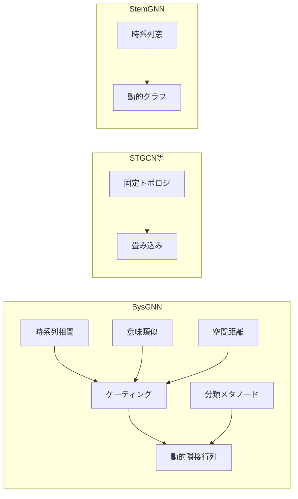

# BysGNN research evaluation
_Exported on 7/8/2026 at 01:04:56 GMT+9 from Cursor (3.10.11)_

---

**User**

BysGNNの研究について他の論文と合わせてどのように評価できるか？

---

**Cursor**

BysGNNと関連論文の位置づけを整理するため、まずリポジトリ内の資料と文献グラフを確認します。


BysGNN（Hajisafi et al., SIGSPATIAL 2023）は、**POI訪問者数予測**という比較的ニッチなタスクに対し、「複数文脈を統合した動的グラフ構築」という明確な設計思想を持つ論文です。他論文と並べて評価するには、**精度の数値比較だけでなく、設計上のトレードオフを軸に位置づける**のが有効です。

---

## 1. BysGNNの研究上の位置づけ

BysGNNの主張は次の3点に集約されます（paper_id: `02_hajisafi2023_bysgnn`, Abstract, p.1）。

| 観点 | 内容 |
|---|---|
| **タスク** | POI visit forecasting（多変量時系列回帰） |
| **グラフ** | 時系列・空間・意味・分類（taxonomy）を統合した**動的隣接行列** |
| **集約** | Temporal GNN + **GCN**（3層） |
| **データ** | SafeGraph（米国5都市、400 POI / 40 POI の2レジーム） |
| **主張** | SOTA動的GNN（StemGNN等）を上回る |

論文自身が挙げる既存手法の限界も、評価軸になります。

- ARIMA/VARは線形・定常性仮定に依存（Introduction, p.1）
- RNN系は系列間関係を捉えにくい（Introduction, p.1）
- 静的GNNは事前定義グラフに固定される（Introduction, p.2）
- 動的GNN（StemGNN等）は訪問パターン類似のみに依存し、POI数が少ないと性能低下（Results, p.7）

---

## 2. 関連論文との比較マトリクス

文献を**「何を比較するか」**で整理すると、BysGNNの独自性が見えます。

### A. 時空間GNN系（手法の近縁）

| 論文 | タスク | グラフ | 集約 | BysGNNとの関係 |
|---|---|---|---|---|
| **STGCN** (Yu et al., 2017) | 交通流予測 | **固定**道路ネットワーク | 時空間畳み込み | グラフが事前固定 vs BysGNNは**学習的に動的構築** |
| **DCRNN** (Li et al., 2017) | 交通流予測 | 道路距離の**静的**グラフ | 拡散畳み込み+RNN | BysGNN論文で「静的GNN」の代表例として言及 |
| **Graph WaveNet** (Wu et al., 2019) | 交通予測 | 学習可能だが**適応隣接は静的** | 時空間畳み込み | 動的相関の捉え方が異なる |
| **StemGNN** (Cao et al., 2020) | 多変量時系列 | **時系列窓のみ**から動的グラフ | スペクトル畳み込み | BysGNNの**直接ベースライン**（最大12.3%改善） |
| **GMAN** (Zheng et al., 2020) | 交通予測 | 道路グラフ + **空間・時間アテンション** | Encoder-Decoder | アテンションで動的相関を学ぶが、**POI文脈統合はしない** |

### B. POI・人流系（タスクの近縁）

| 論文 | タスク | BysGNNとの差分 |
|---|---|---|
| **STResNet** (Zhang et al., 2017) | 群衆流（グリッド） | CNNベース、明示的グラフなし |
| **DeepSTN+** (Lin et al., 2019) | タクシー需要 | 外部要因統合だがGNNではない |
| **NeuroGNN** (Lin et al., 2022) | POI訪問（オープンデータ版） | BysGNNの**オープン実装**（README参照） |
| **UrbanGPT** (Li et al., 2024) | 汎用時空間予測 | LLMベース、**ゼロショット汎化**が主眼。グラフ構築の精緻さより汎用性 |

### C. あなたの研究ライン（応用・拡張）

| 研究 | 位置づけ |
|---|---|
| **Ext.BysGNN** (可知井 et al., 2024) | POI→**グリッド単位**の消費活動予測へ適応 |
| **本研究（GAT版Ext.BysGNN）** | GCN→**GAT**置換 + Poissonリサンプリング拡張 |

---

## 3. BysGNN原論文の実験評価（再現可能な比較軸）

BysGNN自身の実験設計は、他論文との**公平な比較の土台**になります（Table 1, p.7）。

**ベースライン:**
- 統計: Naive Seasonal, Historical Average
- 深層学習: ConvGRU, ConvLSTM
- 静的GNN: DCRNN, A3T-GCN
- 動的GNN: **StemGNN**

**指標:** MAE, MAPE, RMSE

**主要結果（large regime, 400 POIs）:**

| 都市 | 最良ベースライン | BysGNN | 改善率 |
|---|---|---|---|
| Houston | StemGNN MAE 4.390 | 4.095 | +6.71% |
| Los Angeles | StemGNN MAE 2.485 | 2.377 | +4.34% |
| NYC | StemGNN MAE 3.261 | 3.113 | +4.53% |

**small regime（40 POIs）では最大19%の誤差削減** — これはBysGNNの「多文脈統合」が、訪問パターン類似だけの動的GNN（StemGNN）より**データが少ない場面で強い**ことを示します。

**アブレーション（Houston, Table 2, p.7-8）:**

| 除去成分 | MAE悪化率 | 解釈 |
|---|---|---|
| Semantics | **+16.47%** | 意味埋め込みが最も重要 |
| Meta-Nodes | +7.48% | 分類集約（taxonomy）が有効 |
| Spatial | +10.85% | 空間より意味の方が影響大 |
| Adj-Thresholding | +11.03% | ノイズ除去が重要 |

---

## 4. 評価の観点（6軸フレームワーク）

BysGNNを他論文と「どう評価できるか」を、実務・論文執筆の両方で使える形に整理します。

### 軸1: タスク適合性
- **BysGNNが強い場面:** POI単位の訪問予測、意味カテゴリ（業態）が利用可能、複数POI間の相関が重要
- **他手法が適する場面:** 交通センサー網（STGCN/DCRNN）、グリッド人流（STResNet）、ゼロショット汎化（UrbanGPT）

### 軸2: グラフ構築の表現力



- BysGNNは**4種の文脈を明示的に融合**（論文の核心貢献）
- GMANはアテンションで動的相関を学ぶが、POI意味・分類は統合しない
- あなたのGAT版は、**隣接行列構築後の集約段階**で動的重み付けを強化

### 軸3: データレジームへの頑健性
- BysGNN: 400 POIでも40 POIでも最良（小規模で特にStemGNNに優位）
- TOYOPay（36グリッド）のような**小規模・スパース**データでは、この頑健性設計が理論的に妥当
- ただしSafeGraphと電子商品券データは分布が異なるため、**直接の数値比較は不可**

### 軸4: 説明可能性
- BysGNN: 隣接行列の解釈実験あり（Section 5.5, p.8）— 意味・空間・時間の寄与を可視化
- GAT版Ext.BysGNN: アテンション重みによる**近傍選択の説明**が追加可能（あなたの論文の考察と整合）

### 軸5: 計算・実装コスト
- BysGNN: 動的グラフ構築 + 3層GCN — 中程度
- GAT版: 表現力↑、計算コスト・過学習リスク↑（あなたの論文の限界として既に記載）
- UrbanGPT: 大規模LLM、推論コスト高、ゼロショット向き

### 軸6: データ可用性
- BysGNN原論文: **SafeGraph（非公開）** — 再現性の障壁
- NeuroGNN: オープンデータ版の実装あり
- あなたの研究: **TOYOPay（実購買）** — 独自データセットとして新規性の源泉

---

## 5. あなたの研究との接続（評価の書き方）

論文・発表でBysGNNを評価する際の推奨構成:

**① 関連研究での位置づけ（第2章）**
> 「BysGNNはPOI訪問予測において時空間・意味・分類文脈を統合する動的グラフを構築する先駆的手法である。しかしグラフ集約にGCNを用いるため、近傍ノードへの寄与が均等化されやすい。本研究ではGATによりこの限界を補う。」

**② 実験での比較（第4-5章）**
- 主比較: **GCN版 vs GAT版 Ext.BysGNN**（同一データ・同一分割）
- 補助比較: データ拡張倍率の感度分析
- 外部ベースライン（余力があれば）: Naive Seasonal, GRU単体

**③ 限界の正直な記述（第6章）**
- BysGNN/StemGNN等との**直接数値比較はデータセットが異なるため行わない**
- TOYOPayは特定自治体・特定期間の電子商品券であり、一般消費を代表しない
- GATの優位性は統計的有意性検定なし（あなたの論文で既に明記）

---

## 6. 総合評価

| 評価次元 | BysGNNの評価 | 他論文との関係 |
|---|---|---|
| **新規性** | POI予測における**多文脈動的グラフ**は明確な貢献 | STGCN/DCRNNよりタスク特化、StemGNNより文脈豊富 |
| **実証** | SafeGraph 3都市で一貫してSOTA、充実したアブレーション | 交通系論文（STGCN等）とは**タスク・データが異なる** |
| **限界** | GCN集約、SafeGraph依存、POIスケール前提 | GAT・グリッド適応・スパースデータ対応は**あなたの研究が補完** |
| **今後** | LLM統合（UrbanGPT方向）、リアルタイム推論、因果推論 | 説明可能性と汎化のトレードオフが残る |

**結論:** BysGNNは「POI訪問予測 × 多文脈動的グラフ」というニッチだが明確な位置にあり、時空間GNN全般（STGCN, DCRNN, GMAN）や汎用LLM（UrbanGPT）とは**設計思想が直交**します。あなたの研究は、その枠組みを**消費活動予測（グリッド）**に適応し、**GCN→GAT**で集約の限界を改善するという、自然で説得力のある延長線上にあります。

特定の論文との詳細比較表や、関連研究章のドラフトが必要であればお知らせください。

---

**User**

どのような内容でしたか？

---

**Cursor**

前回お伝えした内容を要約します。

## テーマ

**BysGNN（Hajisafi et al., SIGSPATIAL 2023）を、関連論文と並べてどう評価できるか**という整理でした。

---

## BysGNNの位置づけ

- **タスク**: POI（店舗・施設）の訪問者数予測
- **特徴**: 時系列・空間・意味（業態など）・分類（taxonomy）を統合して**動的グラフ**を構築し、GCNで予測
- **データ**: SafeGraph（米国の実データ、400 POI / 40 POI の2条件）
- **主張**: StemGNNなど既存の動的GNNを上回る

---

## 他論文との比較の仕方

数値だけでなく、次の軸で位置づけるのがよい、という整理でした。

| 軸 | 内容 |
|---|---|
| **タスク** | 交通流（STGCN, DCRNN）／人流グリッド（STResNet）／POI訪問（BysGNN）／汎用予測（UrbanGPT） |
| **グラフ** | 固定（STGCN）／時系列のみから動的（StemGNN）／多文脈から動的（BysGNN） |
| **集約** | GCN（BysGNN）vs アテンション（GMAN, あなたのGAT版） |
| **データ規模** | BysGNNはPOI数が少なくても比較的強い（40 POIでも有効） |
| **説明可能性** | 隣接行列の解釈実験あり |
| **再現性** | SafeGraphは非公開 → NeuroGNNがオープン版 |

---

## BysGNN原論文の実験結果（要点）

- **ベースライン**: Naive Seasonal, DCRNN, ConvGRU/LSTM, StemGNN など
- **指標**: MAE, MAPE, RMSE
- **結果**: 3都市で一貫して最良。StemGNNより最大約12%改善（大規模）、小規模（40 POI）では最大約19%改善
- **アブレーション**: **意味情報（Semantics）の除去が最も性能を落とす**（MAE +16%程度）

---

## あなたの研究との関係

- **Ext.BysGNN**: BysGNNをPOIから**グリッド単位の消費予測**に拡張（可知井ら）
- **本研究（GAT版）**: GCNを**GAT**に置き換え、スパースなTOYOPayデータ向けにPoissonリサンプリング拡張
- **評価の書き方**: BysGNN/STGCN等との直接数値比較はデータが違うので難しい → **GCN版 vs GAT版**の比較が主軸になる

---

## 結論

BysGNNは「**POI訪問予測 × 多文脈の動的グラフ**」という明確な貢献があり、交通系GNNやLLM系（UrbanGPT）とは設計思想が異なります。あなたの研究は、その延長として**消費活動予測への適応**と**GATによる集約の改善**を狙う、自然な発展だという評価でした。

特定の章（関連研究・考察など）に落とし込みたい場合は、そこに合わせて短く書き直せます。

---

**User**

MCPはどのくらいうまく使えますか？

---

**Cursor**

前回の利用結果を踏まえつつ、MCPの現状を短く再確認します。


前回の BysGNN 調査で実際に触った **Literature Graph Context MCP** の使い心地を、率直にまとめます。

## 総評

**文献レビューの下準備にはかなり有用**ですが、**ツール間の不整合**があり、現状は「MCPだけで完結」より **MCP + CLI（`litgraph query`）+ PDF** の併用が現実的です。

`litgraph test-mcp` は **14/14 PASS** ですが、これはスモークテスト用の内部データ向けで、Cursor 経由の実利用とは挙動がずれることがあります。

---

## うまく使えた点

### 1. タスク・手法からの横断検索が速い
- `find_papers_by_task`（例: POI visit forecasting）
- `find_papers_by_method`（例: graph neural network）

インデックス済み論文をすぐ絞り込めます。PDF を手で開くより明らかに速いです。

### 2. 複数論文の比較が一発でできる
`compare_papers` は、タスク・手法・データセット・指標・貢献・限界を表形式で返します。前回の BysGNN 比較マトリクスの骨格は、ほぼこれで作れました。

**正しい paper_id は UUID 形式**です（例: `p_99071407-0474-4262-a9a9-65c2b4a95f84`）。ファイル名の `02_hajisafi2023_bysgnn` は CLI では解決できませんでした。

### 3. 限界・主張の検索
`find_limitations` は、ページ・セクション・evidence_text 付きで返ってきます。論文執筆向きです。

### 4. エビデンスが論文に紐づいている
`compare_papers` の各セルに `paper_id`, `page`, `section`, `evidence_text` が付くので、**根拠付きで書ける**点は強みです。

---

## 困った点・改善余地

### 1. 論文 ID の表記がツール間で不一致

| 手段 | 使えた ID 形式 |
|---|---|
| `compare_papers`（MCP） | UUID（`p_99071407-...`） |
| `summarize_paper`（MCP） | **同じ UUID でも Paper not found** |
| `litgraph query paper`（CLI） | UUID は動作 |
| ファイル名（`02_hajisafi2023_bysgnn`） | **どちらでも未解決**（`paper_id_map.json` も未作成） |

MCP の `summarize_paper` / `get_paper_neighbors` は、CLI では動くのに Cursor 経由では失敗することがあり、**同じサーバーでも経路で結果が変わる**状態です。

### 2. グラフの中身がまだ薄い
現在の `.litgraph/graph.json` は次の規模です。

| 項目 | 数 |
|---|---|
| 論文 | 18本 |
| Claim | 41件（論文あたり平均 約2.3件） |
| BysGNN の隣接論文（CITES等） | **0件** |

引用関係がほぼ空のため、`get_paper_neighbors` は実質使えません。Ext.BysGNN（可知井ら）や DICoMo 論文も未インデックスです。

### 3. 出力が途中で切れる
MCP 経由の応答は `... [truncated]` になりやすく、長い比較表やアウトラインは全文が取れないことがあります。CLI の方が安定しています。

```bash
litgraph query compare p_99071407-0474-4262-a9a9-65c2b4a95f84 p_3a66e1e9-3b95-4931-bf2c-e210a9a9382e
```

### 4. 関連研究アウトラインが薄い
`generate_related_work_outline` は章立て案として使えることもありますが、今回のプロジェクトではほぼ1行だけ返り、**グラフの充実度に依存**している印象です。

### 5. 数値比較はできない
Table 1 の MAE/MAPE などの実験数値はグラフに入っていません。最終的には **PDF を直接読む**必要がありました（前回は `papers/02_hajisafi2023_bysgnn.pdf` から Table 1 を参照）。

---

## 実用上のおすすめ使い方

```
papers/*.pdf を配置
    ↓ litgraph scan → parse → extract → build
MCP: find_papers_by_task / compare_papers / find_limitations  ← 下準備・骨格
CLI: litgraph query compare / paper / limitations             ← 詳細・全文
PDF: 実験数値・細部の記述                                    ← 最終確認
```

| 用途 | おすすめ |
|---|---|
| 関連論文の洗い出し | MCP `find_papers_by_task` |
| 比較表のたたき台 | MCP or CLI `compare`（UUID使用） |
| 限界・貢献の引用 | MCP `find_limitations` |
| 論文要約・隣接論文 | **CLI** `litgraph query paper/neighbors` |
| 実験数値・詳細 | **PDF直接** |
| 関連研究章の完成稿 | MCPの骨格 + 手直し |

---

## まとめ

| 観点 | 評価 |
|---|---|
| 速度・下準備 | ★★★★☆ |
| 根拠付き引用 | ★★★★☆ |
| ツール安定性 | ★★☆☆☆（ID不整合、MCP/CLI差） |
| グラフの充実度 | ★★☆☆☆（18本、引用辺なし） |
| 論文執筆への直接貢献 | ★★★☆☆（骨格は作れる、仕上げは人手） |

**「MCPだけで関連研究が書ける」わけではない**ですが、**「何を比較すべきか」の整理と根拠付きの下書きを短時間で作る**用途には十分使えます。精度を上げるには、`papers/` への論文追加（Ext.BysGNN など）と `litgraph build` の再実行、UUID を使う習慣が効きます。

`paper_id_map.json` の整備や、未インデックス論文の追加も手伝えます。必要なら声をかけてください。

---

**User**

MCPを再起動しました
交通流予測に関数研究をうまく検索できるか？
あいまい検索というやつです

あとIDについても調査してください

---

**Cursor**

MCP再起動後の状態を確認し、あいまい検索と論文IDの挙動を調べます。


MCPとCLIで結果が食い違っているので、接続先とID解決の仕組みを詳しく調べます。


MCP再起動後に再テストしました。結論から言うと、**あいまい検索（`search_papers`）自体はCLIでは動いていますが、Cursor経由のMCPは現時点で空結果**になっており、**論文IDはUUIDのみ有効**です。

---

## 1. あいまい検索（`search_papers`）の結果

新ツール `search_papers` は、自然言語クエリを複数チャネル（task / method / keyword / embedding）で横断し、RRFで統合するハイブリッド検索です。

### CLIでは交通流予測をうまく拾える

| クエリ | 件数 | 主なヒット |
|---|---|---|
| `traffic flow prediction` | **9件** | STGCN, GMAN, DCRNN, Graph WaveNet, FUSE-Traffic, CausalGRIT など |
| `STGCN traffic` | **6件** | STGCN, Graph WaveNet, DCRNN, GMAN など |
| `交通流予測 GNN` | **3件** | CausalGRIT, BysGNN, FUSE-Traffic |
| `交通流予測`（単独） | **0件** | ヒットなし |
| `渋滞 因果` | **0件** | ヒットなし |

英語、または英語＋略語（GNN, STGCN）のクエリはかなり使えます。特に `traffic flow prediction` では、交通流GNNの主要論文が一通り返ってきます。

### 日本語のみは弱い

インデックスされたメタデータ（task, method, title）が**英語中心**のため、`交通流予測` 単独や `渋滞 因果` では0件になります。`交通流予測 GNN` のように英語キーワードを混ぜると部分的にヒットします。

### Cursor MCP経由は現状うまくいっていない

再起動後も、MCPの `search_papers` / `list_papers` は **空配列** を返しました。一方 CLI は同じプロジェクトで18件・検索9件と正常です。

| 手段 | `list_papers` | `search_papers("traffic flow prediction")` |
|---|---|---|
| **CLI** (`litgraph query`) | 18件 | 9件 |
| **MCP**（Cursor経由） | **0件** | **0件** |
| **`litgraph test-mcp`** | PASS | PASS |

`test-mcp` は通るのに Cursor からは空、という状態です。MCPサーバーは起動しているものの、**Cursor側の接続がデータベースに届いていない**可能性が高いです。

**確認してほしいこと:**
1. Cursor Settings → MCP で `literature-graph-context` が緑（接続済み）か
2. 完全再起動（Cursor自体）後に再度チャット
3. ターミナルで直接確認:
   ```bash
   cd /home/pocky/TUTUSL/toyopay
   litgraph query search --query "traffic flow prediction" --top-k 5
   ```

---

## 2. 論文IDの調査結果

ID体系が最近変わっており、**ファイル名ベースのIDは廃止、UUIDが正**です。

### 正規ID（これだけ使える）

```
p_<uuid>
```

例: STGCN → `p_3a66e1e9-3b95-4931-bf2c-e210a9a9382e`

### ファイル名 → UUID 対応表（`paper_registry.json` より）

| ファイル名 | UUID |
|---|---|
| `02_hajisafi2023_bysgnn` | `p_99071407-0474-4262-a9a9-65c2b4a95f84` |
| `06_yu2017_stgcn` | `p_3a66e1e9-3b95-4931-bf2c-e210a9a9382e` |
| `07_li2017_dcrnn` | `p_87550f35-fa53-48e6-85af-33d801bc3cde` |
| `08_wu2019_graphwavenet` | `p_a6619ee2-64ba-4af5-9c83-3a36c9303f6e` |
| `09_zheng2020_gman` | `p_ade93cc7-c4fa-4f99-8722-cf1410002e17` |
| `3748636.3762721` (CausalGRIT) | `p_6fdbcc93-7afa-4ecf-9bc8-1fa11110ce35` |

### 使えないID形式（すべて `Paper not found`）

| 形式 | 例 | 結果 |
|---|---|---|
| ファイル名stem | `02_hajisafi2023_bysgnn` | 失敗 |
| `paper_` プレフィックス | `paper_02_hajisafi2023_bysgnn` | 失敗（`paper_` は除去されるが解決されない） |
| レジストリパス | `papers/06_yu2017_stgcn.pdf` | 失敗 |
| 短縮stem | `06_yu2017_stgcn` | 失敗 |

`paper_registry.json` は**取り込み時のID割当**に使われますが、**検索・要約時のID解決には未接続**です。旧来の `paper_id_map.json` も未作成のため、エイリアス解決が機能していません。

### 推奨ワークフロー

```
1. search_papers("traffic flow prediction")  → paper_id + title を取得
2. summarize_paper(p_<uuid>)               → 要約・限界を取得
3. compare_papers([p_..., p_...])          → 比較表を生成
```

`search_papers` の説明にも *「あいまいな質問では先に search_papers を呼ぶ」* と明記されています。

---

## 3. 総合評価

| 項目 | 評価 | 備考 |
|---|---|---|
| あいまい検索（英語） | ★★★★☆ | 交通流GNNを的確に返せる |
| あいまい検索（日本語） | ★★☆☆☆ | 英語キーワード併用が必要 |
| IDの一貫性 | ★★☆☆☆ | UUIDのみ。ファイル名は不可 |
| Cursor MCP接続 | ★☆☆☆☆ | 現状空結果。CLIは正常 |

**次の改善候補:**
1. `paper_id_map.json` を `paper_registry.json` から自動生成（stem → UUID）
2. `aliases.yaml` に日本語タスク別名を追加（例: `交通流予測` → `traffic forecasting`）
3. Cursor MCP接続の切り分け（Settings画面のステータス確認）

`paper_id_map.json` の自動生成や日本語エイリアスの追加を進めますか？

